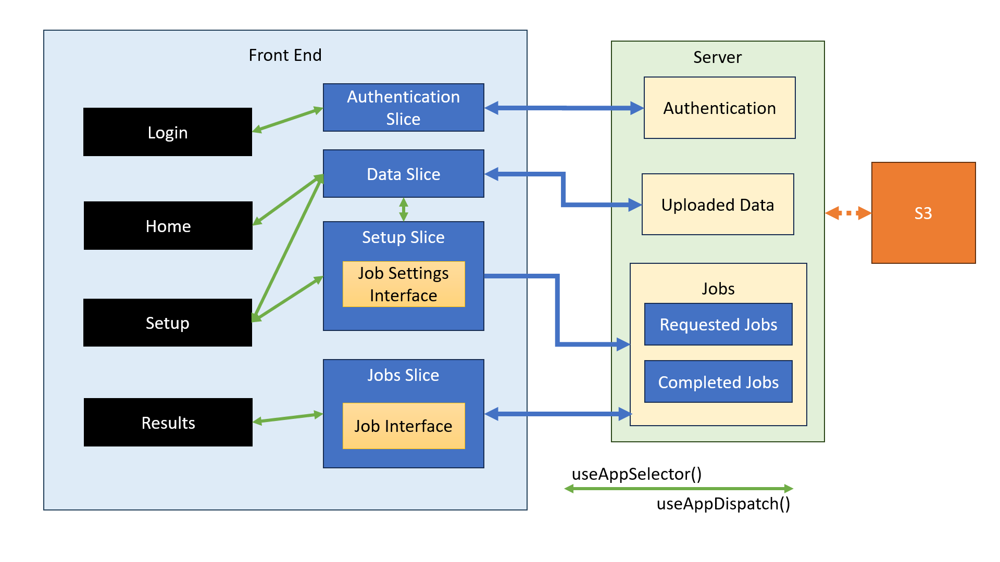

# Getting Started with TESS Frontend

This project was bootstrapped with [Create React App](https://github.com/facebook/create-react-app).

## Available Scripts

In the project directory, you can run:

### `yarn start`

Runs the app in the development mode.\
Open [http://localhost:3000](http://localhost:3000) to view it in the browser.

The page will reload if you make edits.\
You will also see any lint errors in the console.

### `yarn test`

Launches the test runner in the interactive watch mode.\
See the section about [running tests](https://facebook.github.io/create-react-app/docs/running-tests) for more information.

### `yarn build`

Builds the app for production to the `build` folder.\
It correctly bundles React in production mode and optimizes the build for the best performance.

The build is minified and the filenames include the hashes.\
Your app is ready to be deployed!

See the section about [deployment](https://facebook.github.io/create-react-app/docs/deployment) for more information.

### `yarn eject`

**Note: this is a one-way operation. Once you `eject`, you can’t go back!**

If you aren’t satisfied with the build tool and configuration choices, you can `eject` at any time. This command will remove the single build dependency from your project.

Instead, it will copy all the configuration files and the transitive dependencies (webpack, Babel, ESLint, etc) right into your project so you have full control over them. All of the commands except `eject` will still work, but they will point to the copied scripts so you can tweak them. At this point you’re on your own.

You don’t have to ever use `eject`. The curated feature set is suitable for small and middle deployments, and you shouldn’t feel obligated to use this feature. However we understand that this tool wouldn’t be useful if you couldn’t customize it when you are ready for it.

## Redux Structure
Redux control the work flow of this frontend. Relevant redux definitions are in folder ./src/features
* Root level reducer: ./store.ts
  * /authenticate/authenticateSlice.ts
  * /home/homeSlice.ts
  * /setup/setupSlice.ts
  * /results/resultsSlice.ts

### Library dependency: 
* redux-toolkit
  * Core functions: 
    * createSlice
      * Defines the initial state, reducer (with action thunks automatically generated),
      and extra reducer (for handling external actions under the same parent address)
    * createAction
      * Creates a standalone action creator function that accepts any payload
    * createAsyncThunk
      * Creates an async thunk that upon calling generates an action, and a corresponding payload
      that gets passed to reducer functions listening for this event
    * configureStore (wraps redux-createStore)
      * Configures the root store based on the root reducers and middlewares
* redux
  * Core functions:
    * store.dispatch(action)
      * What one calls to invoke an action
    * store.getState()
      * What one calls to receive the entire state
    * createStore(reducer(s))
    * combineReducers
      * Combines separate reducers into one, concatenates together the 
      reducer names.
* react-redux
  * The combination of react-redux core functions provide accessibility of 
  relevant redux functionalities within react component definitions. Enables automatic
  invocation of re-rendering upon relevant state updates.
  * Core functions:
    * Provider
    * use(App)Selector((state)=>{return state.usage})
    * use(App)Dispatch()
    
### Data flow

## MR Optimum Server APIs
